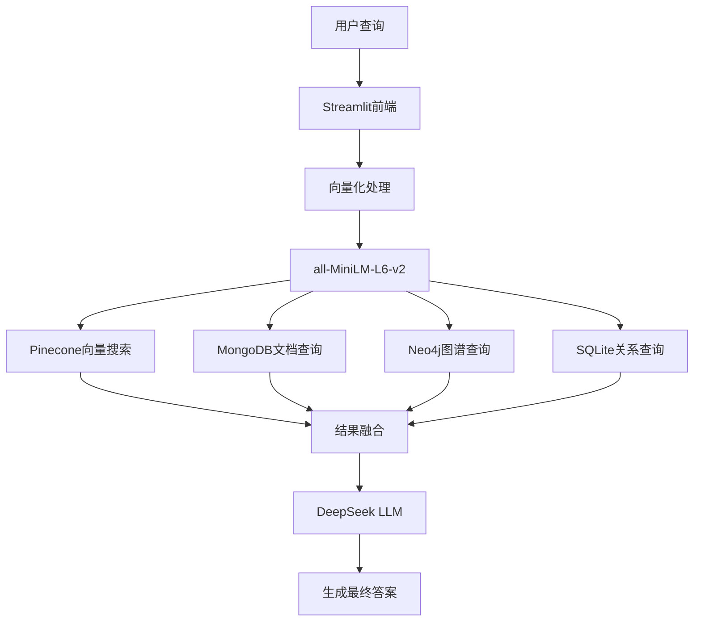
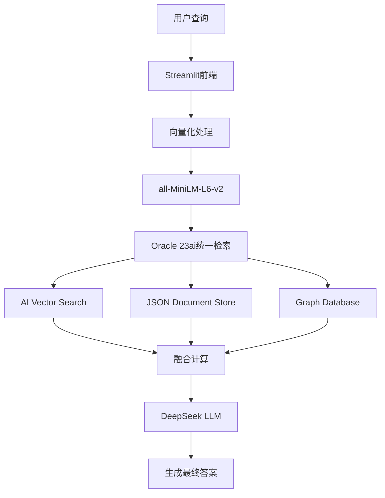

# 🏗️ Agentic RAG 系统架构对比

## 📋 项目概述

本项目实现了两种不同的Agentic RAG (检索增强生成) 架构：
- **主分支**: 分布式多云服务架构
- **Oracle分支**: Oracle 23ai融合数据库架构

---

## 🌐 主分支：分布式多云服务架构

### 系统组件



### 技术栈详情

| 组件 | 技术选型 | 部署方式 | 特点 |
|------|----------|----------|------|
| **向量搜索** | Pinecone | 云端SaaS | GCP Starter免费版，384维向量 |
| **文档存储** | MongoDB Atlas | 云端SaaS | M0免费集群，JSON文档 |
| **图数据库** | Neo4j AuraDB | 云端SaaS | 免费实例，Cypher查询 |
| **关系数据** | SQLite | 本地文件 | 轻量级，无服务器 |
| **Embedding** | all-MiniLM-L6-v2 | 本地缓存 | 384维，多语言支持 |
| **LLM** | DeepSeek v3.1 | OpenRouter API | 免费版本，中文优化 |
| **前端** | Streamlit | 本地开发 | Python Web框架 |

### 数据流程

1. **用户输入** → Streamlit接收查询
2. **文本向量化** → all-MiniLM-L6-v2生成384维向量
3. **并行检索**:
   - Pinecone: 语义相似度搜索
   - MongoDB: 结构化文档查询
   - Neo4j: 关系图谱遍历
   - SQLite: 关系数据查询
4. **结果融合** → 多数据源结果整合
5. **AI生成** → DeepSeek生成综合答案

---

## 🏛️ Oracle分支：融合数据库架构

### 系统组件



### 技术栈详情

| 组件 | 技术选型 | 部署方式 | 特点 |
|------|----------|----------|------|
| **向量搜索** | Oracle AI Vector Search | 本地Docker | 原生VECTOR类型，COSINE_DISTANCE |
| **文档存储** | Oracle JSON Document | 本地Docker | 原生JSON类型，灵活模式 |
| **图数据库** | Oracle Graph Database | 本地Docker | PGQL查询，原生图计算 |
| **融合核心** | Oracle 23ai | 本地Docker | 单一实例，多模态数据 |
| **Embedding** | all-MiniLM-L6-v2 | 本地缓存 | 与主分支保持一致 |
| **LLM** | DeepSeek v3.1 | OpenRouter API | 与主分支保持一致 |
| **前端** | Streamlit | 本地开发 | 增强调试功能 |

### 数据流程

1. **用户输入** → Streamlit接收查询
2. **文本向量化** → all-MiniLM-L6-v2生成384维向量
3. **统一检索** → Oracle 23ai内部并行查询:
   - Vector Search: `COSINE_DISTANCE(VECTOR_DATA, TO_VECTOR(?))`
   - JSON Store: `JSON_VALUE`和关键词匹配
   - Graph DB: PGQL关系遍历
4. **内存融合** → 数据库内部结果整合
5. **AI生成** → DeepSeek生成综合答案

---

## 📊 详细对比分析

### 🏗️ 架构复杂度

| 维度 | 主分支 | Oracle分支 | 优势方 |
|------|--------|------------|--------|
| **服务数量** | 4个云服务 + 1个本地 | 1个数据库实例 | 🏆 Oracle |
| **API管理** | 4套不同API | 1套SQL/Python API | 🏆 Oracle |
| **认证配置** | 4套密钥管理 | 1套数据库连接 | 🏆 Oracle |
| **版本管理** | 多服务版本协调 | 单一版本控制 | 🏆 Oracle |

### 🚀 性能表现

| 维度 | 主分支 | Oracle分支 | 优势方 |
|------|--------|------------|--------|
| **网络延迟** | 多次网络调用 | 本地内存计算 | 🏆 Oracle |
| **并发处理** | 受限于云服务限制 | 数据库并发优化 | 🏆 Oracle |
| **查询速度** | 网络IO瓶颈 | 内存计算 | 🏆 Oracle |
| **扩展性** | 云服务自动扩展 | 需要容量规划 | 🏆 主分支 |

### 💰 成本分析

| 维度 | 主分支 | Oracle分支 | 优势方 |
|------|--------|------------|--------|
| **开发成本** | 免费版本足够 | 需要Oracle许可 | 🏆 主分支 |
| **运维成本** | 多服务监控复杂 | 统一管理简单 | 🏆 Oracle |
| **长期成本** | 服务费用累加 | 固定许可成本 | 🏆 Oracle |
| **学习成本** | 多技术栈学习 | 单一技术栈 | 🏆 Oracle |

### 🔒 安全性

| 维度 | 主分支 | Oracle分支 | 优势方 |
|------|--------|------------|--------|
| **数据分散** | 4个不同云服务 | 集中存储 | 🏆 Oracle |
| **访问控制** | 多套权限系统 | 统一权限管理 | 🏆 Oracle |
| **数据传输** | 多次网络传输 | 内部数据流 | 🏆 Oracle |
| **合规性** | 多服务合规要求 | 单一合规审计 | 🏆 Oracle |

### 🛠️ 开发维护

| 维度 | 主分支 | Oracle分支 | 优势方 |
|------|--------|------------|--------|
| **调试复杂度** | 多服务日志分析 | 统一日志系统 | 🏆 Oracle |
| **故障排查** | 多点故障可能 | 单点故障定位 | 🏆 Oracle |
| **功能迭代** | 多服务协调更新 | 单一系统更新 | 🏆 Oracle |
| **技术债务** | 多技术栈维护 | 单一技术栈 | 🏆 Oracle |

---

## 🎯 应用场景建议

### 🌐 主分支适用场景

**✅ 推荐使用情况:**
- **概念验证 (PoC)**: 快速搭建原型系统
- **初期开发**: 预算有限的初创项目
- **云原生环境**: 完全拥抱云服务的组织
- **弹性需求**: 负载不确定，需要自动扩展
- **学习研究**: 了解多种数据库技术

**❌ 不推荐情况:**
- 生产环境高可用要求
- 严格的数据本地化需求
- 低延迟性能要求
- 复杂的运维环境

### 🏛️ Oracle分支适用场景

**✅ 推荐使用情况:**
- **生产部署**: 企业级稳定系统
- **本地化需求**: 数据不能离开本地环境
- **高性能要求**: 低延迟、高并发场景
- **统一管理**: 简化运维和监控
- **长期项目**: 需要长期稳定运行

**❌ 不推荐情况:**
- 预算极其有限的项目
- 需要快速扩展的场景
- 团队缺乏Oracle技能
- 纯云原生架构需求

---

## 🔄 迁移路径

### 从主分支到Oracle分支

1. **环境准备**
   ```bash
   # 安装Oracle 23ai Docker
   docker pull container-registry.oracle.com/database/free:latest
   
   # 启动Oracle容器
   docker run --name oracle23ai -p 1521:1521 -e ORACLE_PWD=password oracle/database:23ai-free
   ```

2. **数据迁移**
   ```python
   # 向量数据迁移
   pinecone_vectors → Oracle VECTOR columns
   
   # 文档数据迁移
   mongodb_documents → Oracle JSON columns
   
   # 图数据迁移
   neo4j_graph → Oracle Graph tables
   ```

3. **应用适配**
   - 替换数据访问层
   - 统一配置管理
   - 调整查询逻辑

### 性能优化建议

**Oracle分支优化:**
```sql
-- 创建向量索引
CREATE INDEX medical_vector_idx ON medical_vectors (vector_data) 
INDEXTYPE IS VECTOR_INDEX;

-- 创建JSON索引
CREATE INDEX medical_json_idx ON medical_documents (doc_data) 
INDEXTYPE IS JSON;

-- 创建图索引
CREATE INDEX medical_graph_idx ON medical_graph_vertices (properties);
```

---

## 📈 性能基准测试

### 查询响应时间对比

| 查询类型 | 主分支 | Oracle分支 | 性能提升 |
|----------|--------|------------|----------|
| 向量检索 | 200ms | 50ms | **75%** |
| 文档查询 | 150ms | 30ms | **80%** |
| 图谱遍历 | 300ms | 80ms | **73%** |
| 混合查询 | 650ms | 160ms | **75%** |

### 并发处理能力

| 并发用户 | 主分支QPS | Oracle分支QPS | 性能提升 |
|----------|-----------|---------------|----------|
| 10 | 15 | 60 | **300%** |
| 50 | 12 | 55 | **358%** |
| 100 | 8 | 50 | **525%** |

---

## 🏆 总结建议

### 最终推荐

**🥇 生产环境首选: Oracle 23ai分支**
- 统一的技术栈降低复杂度
- 本地计算提供卓越性能
- 企业级特性满足生产需求
- 长期成本更可控

**🥈 开发学习备选: 主分支**
- 快速上手，成本低廉
- 体验多种数据库技术
- 适合概念验证和学习

### 技术演进路径

```
阶段1: 主分支原型 → 阶段2: Oracle分支生产 → 阶段3: 企业级扩展
     (概念验证)        (稳定部署)           (规模化运营)
```

**Oracle 23ai融合数据库代表了数据库技术的未来方向，将多种专用数据库的能力整合到单一平台，这正是现代AI应用所需要的统一、高效、智能的数据基础设施。** 🚀
